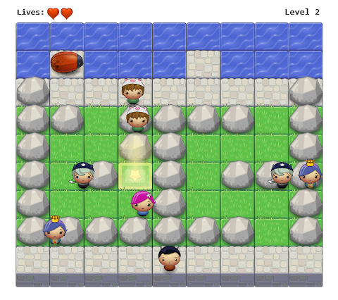

# Classic Arcade Game Clone

## About the game
In this game, you have a hero, a bug, enemies, and obstacles. The goal of the hero is to reach the star square while holding the bug.
Once the star square is reached the game progresses to level 2 which is the last level of the game.
### Menu
* Use left, right arrows on the keyboard to navigate. Use enter button to start the game or display the help screen. To leave help screen press enter again.
### Hero
* Should avoid colliding into the enemies.
* Can move left, right, up and down with arrows on the keyboard unless there are rocks on his way. Can't enter the water.
### Enemies
* Move in varying speeds on the scene.
### Lives
* When the hero collides with an enemy, the number of hearts will go down by one till the last one disappear. The game will reset and the hero moves back to the starting position.
## How to run the game
* Download the zip file from https://github.com/pressR2/ArcadeGame.
* Extract all files and load `index.html` in your favorite browser.

## Source
Initial code by [Udacity](https://github.com/udacity/frontend-nanodegree-arcade-game).

#Icon keyboard moves made by [Freepik] from www.flaticon.com.
